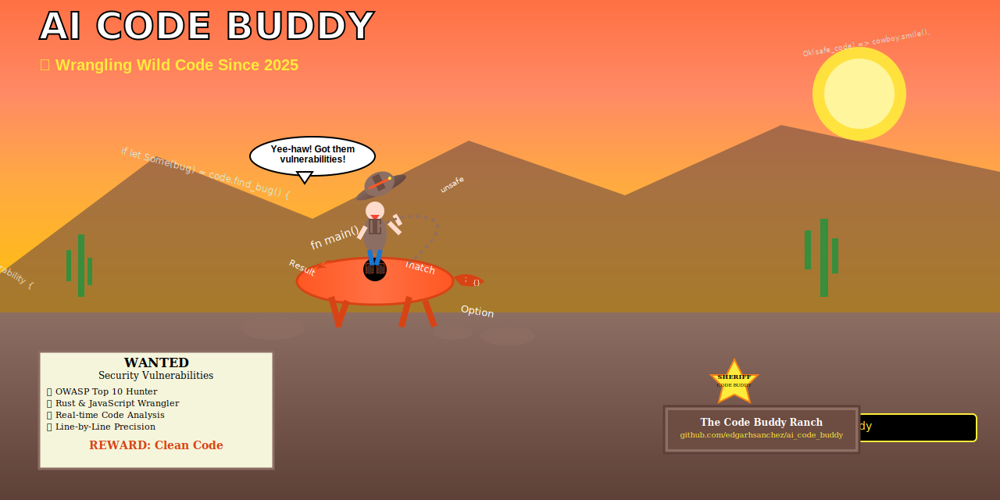

# AI Code Buddy



[](https://crates.io/crates/ai-code-buddy)
[](https://opensource.org/licenses/MIT)

🤖 An AI-powered code review tool that analyzes Git repositories and provides intelligent feedback on code quality, security, performance, and maintainability.

## Features

- 🔍 **Intelligent Code Analysis**: Uses AI-powered pattern matching to analyze code and provide meaningful suggestions
- 🛡️ **OWASP Security Analysis**: Comprehensive OWASP Top 10 vulnerability detection with precise line-by-line reporting
- 🌲 **Git Branch Comparison**: Compare commits between branches with detailed diff analysis
- 🎯 **Multi-Language Support**: Supports Rust, JavaScript, Python, and more programming languages
- 📊 **Detailed Reporting**: Categorized issues by severity (Critical, High, Medium, Low, Info)
- 🖥️ **Dual Interface**: Both CLI and interactive TUI modes
- 📋 **Multiple Output Formats**: Summary, detailed, JSON, and Markdown output formats
- 🎨 **File Filtering**: Include/exclude files using glob patterns
- 👥 **Credits System**: Track and display all project contributors
- 🔧 **Professional CLI**: Complete argument parsing with help and validation

## Installation

### From crates.io

```bash
cargo install ai-code-buddy
```

### From source

```bash
git clone https://github.com/edgarhsanchez/ai_code_buddy.git
cd ai_code_buddy
cargo build --release
```

## Command Line Interface

### Usage

```bash
ai-code-buddy [OPTIONS] [REPO_PATH]
```

### Arguments

| Argument | Description | Default |
|----------|-------------|---------|
| `[REPO_PATH]` | Path to the Git repository | Current directory (`.`) |

### Options

| Option | Short | Description | Default | Example |
|--------|-------|-------------|---------|---------|
| `--source <BRANCH>` | `-s` | Source branch to compare from | `main` | `-s feature-branch` |
| `--target <BRANCH>` | `-t` | Target branch to compare to | `HEAD` | `-t develop` |
| `--cli` | | Run in CLI mode with text output | Interactive TUI | `--cli` |
| `--verbose` | `-v` | Enable verbose output for debugging | Off | `-v` |
| `--credits` | | Show credits and list all contributors | Off | `--credits` |
| `--format <FORMAT>` | `-f` | Output format for results | `summary` | `-f json` |
| `--exclude <PATTERN>` | | Exclude files matching glob pattern | None | `--exclude "test_files/**"` |
| `--include <PATTERN>` | | Include only files matching glob pattern | None | `--include "src/**"` |
| `--help` | `-h` | Print help information | | `--help` |
| `--version` | `-V` | Print version information | | `--version` |

### Output Formats

| Format | Description | Use Case |
|--------|-------------|----------|
| `summary` | Summary output with key findings | Quick overview and human review |
| `detailed` | Detailed output with all issues | Comprehensive analysis |
| `json` | JSON format for programmatic use | CI/CD integration, tooling |
| `markdown` | Markdown format for documentation | GitHub Issues, documentation |

## Examples

### Basic Usage

#### 1. Quick Analysis (Interactive Mode)
```bash
ai-code-buddy
```
*Launches the interactive TUI interface for exploring issues.*

#### 2. CLI Analysis with Summary
```bash
ai-code-buddy --cli
```

**Output Example:**
```
🔍 AI Code Review Tool v0.1.0
📂 Repository: .
🌿 Comparing: main → HEAD

🎯 Code Review Summary
==========================================
🌿 Branches: main → test-ai-analysis
📁 Files modified: 8
➕ Lines added: 6
➖ Lines removed: 702
🐛 Total issues: 1

🤖 AI Assessment:
Based on the code changes between branches, I've analyzed 2 files with detailed attention to security, performance, and code quality.

KEY FINDINGS:
• src/main.rs:
  🚨 CRITICAL: Line 84: Potential command injection vulnerability
  ⚠️  HIGH: Line 93: Potential path traversal vulnerability
  ⚠️  MEDIUM: Line 377: Inefficient string concatenation pattern

📊 Technology Stack:
  Languages: Rust, JavaScript, Python

🔍 Issues by Category:
  Maintainability: 1 issues
    🔶 src/main.rs:221
      Function is too long
```

### Advanced Usage

#### 3. Compare Specific Branches
```bash
ai-code-buddy --cli --source feature-branch --target main
```

#### 4. Exclude Test Files
```bash
ai-code-buddy --cli --exclude "test_files/**" --exclude "**/tests/**"
```

#### 5. Include Only Source Files
```bash
ai-code-buddy --cli --include "src/**" --include "lib/**"
```

#### 6. JSON Output for CI/CD
```bash
ai-code-buddy --cli --format json --source main --target HEAD
```

**JSON Output Example:**
```json
{
  "branch_comparison": {
    "source_branch": "main",
    "target_branch": "test-ai-analysis",
    "commits_analyzed": []
  },
  "metrics": {
    "files_modified": 8,
    "lines_added": 6,
    "lines_removed": 702
  },
  "technology_stack": {
    "programming_languages": ["Rust", "JavaScript"],
    "frameworks": [],
    "tools": []
  },
  "issues": {
    "Maintainability": [
      {
        "category": "Maintainability",
        "severity": "Medium",
        "description": "Function is too long",
        "file_path": "src/main.rs",
        "line_number": 221,
        "suggestion": "Consider breaking this function into smaller, more focused functions"
      }
    ]
  }
}
```

#### 7. Markdown Report Generation
```bash
ai-code-buddy --cli --format markdown --source main --target feature-branch
```

#### 8. Verbose Analysis with Debugging
```bash
ai-code-buddy --cli --verbose --source main --target HEAD
```

#### 9. Show Contributors and Credits
```bash
ai-code-buddy --credits
```

#### 10. OWASP Security Analysis Example
```bash
ai-code-buddy --cli --include "test_files/javascript/owasp_vulnerabilities.js"
```

**OWASP Analysis Output Example:**
```
🔍 AI Code Review Tool v0.1.0
📂 Repository: .
🌿 Comparing: main → HEAD

• test_files/javascript/owasp_vulnerabilities.js:
  🚨 CRITICAL [OWASP A01]: Line 11: Insecure Direct Object Reference
  🚨 CRITICAL [OWASP A03]: Line 11: SQL injection vulnerability
  🚨 CRITICAL [OWASP A01]: Line 15: Missing authorization check for admin endpoint
  🚨 CRITICAL [OWASP A02]: Line 34: Hardcoded secrets/credentials
  🚨 CRITICAL [OWASP A02]: Line 35: Hardcoded secrets/credentials
  🚨 CRITICAL [OWASP A02]: Line 36: Hardcoded secrets/credentials
  🚨 CRITICAL [OWASP A02]: Line 42: Weak cryptographic algorithm
  ⚠️  HIGH [OWASP A02]: Line 48: Insecure storage of sensitive data
  🚨 CRITICAL [OWASP A03]: Line 58: SQL injection vulnerability
  🚨 CRITICAL [OWASP A03]: Line 73: Command injection vulnerability
  🚨 CRITICAL [OWASP A03]: Line 171: Code injection vulnerability via eval()
  🚨 CRITICAL [OWASP A03]: Line 178: Code injection vulnerability via eval()
  ⚠️  HIGH [OWASP A09]: Line 195: Logging sensitive information
  🚨 CRITICAL [OWASP A03]: Line 232: DOM-based XSS vulnerability
```

**Credits Output Example:**
```
🎉 AI Code Buddy - Credits & Contributors
==========================================

📚 About AI Code Buddy:
AI Code Buddy is an intelligent code analysis tool that combines
advanced pattern matching with AI-powered analysis to provide
comprehensive code reviews with precise line-by-line feedback.

👥 Contributors to this project:
==========================================
🥇 Edgar H Sanchez <esanchez@m2iab.com>
   📊 20 commits
   📅 First contribution: 2025-04-02
   📅 Latest contribution: 2025-08-01

🔧 Built with:
  • Rust 🦀 - Systems programming language
  • Kalosm - AI/ML framework
  • Git2 - Git repository analysis
  • Clap - Command-line argument parsing
  • Tokio - Async runtime
```

### File Filtering Examples

#### Include Only Rust Files
```bash
ai-code-buddy --cli --include "**/*.rs"
```

#### Exclude Generated and Build Files
```bash
ai-code-buddy --cli --exclude "target/**" --exclude "node_modules/**" --exclude "dist/**"
```

#### Focus on Source Code Only
```bash
ai-code-buddy --cli --include "src/**" --include "lib/**" --exclude "**/*test*"
```

### CI/CD Integration Examples

#### GitHub Actions Integration
```yaml
- name: Run AI Code Review
  run: |
    cargo install ai-code-buddy
    ai-code-buddy --cli --format json --source ${{ github.event.pull_request.base.ref }} --target ${{ github.event.pull_request.head.ref }} > review.json
```

#### GitLab CI Integration
```yaml
code_review:
  script:
    - cargo install ai-code-buddy
    - ai-code-buddy --cli --format markdown --source $CI_MERGE_REQUEST_TARGET_BRANCH_NAME --target $CI_COMMIT_REF_NAME
```

## Interactive TUI Mode

Launch without `--cli` flag for an interactive interface:

```bash
ai-code-buddy
```

### TUI Features
- **Arrow keys**: Navigate through issues
- **Enter**: View detailed issue information  
- **R**: Generate comprehensive report
- **Q**: Quit application
- **Tab**: Switch between different views
- **Space**: Toggle issue selection

## Issue Categories

- **🔒 Security**: Potential security vulnerabilities
- **🐛 Potential Bugs**: Code patterns that might cause issues  
- **⚡ Performance**: Performance optimization opportunities
- **📚 Documentation**: Missing or inadequate documentation
- **🎨 Style**: Code style and formatting issues
- **🔧 Maintainability**: Code maintainability improvements
- **📖 Readability**: Code readability enhancements
- **🧪 Testing**: Testing-related suggestions

## Configuration

AI Buddy automatically detects:
- Repository technology stack
- Programming languages used
- Code patterns and anti-patterns  
- Git branch structure
- File dependencies and relationships

## Requirements

- Rust 1.70+
- Git repository
- Network connection for AI processing (when available)

## Tips and Best Practices

### Performance Optimization
- Use `--exclude` patterns to skip large directories like `target/`, `node_modules/`, `dist/`
- Focus analysis using `--include` patterns for specific directories
- Use `--format json` for programmatic processing in scripts

### Security Analysis

AI Code Buddy includes comprehensive OWASP Top 10 security analysis with precise line-by-line vulnerability detection:

#### OWASP Top 10 Coverage

- **🚨 A01: Broken Access Control**
  - Insecure Direct Object References
  - Missing authorization checks
  - Path traversal vulnerabilities

- **🔐 A02: Cryptographic Failures**
  - Hardcoded secrets and credentials
  - Weak cryptographic algorithms (MD5, SHA1)
  - Insecure storage of sensitive data

- **💉 A03: Injection**
  - SQL injection vulnerabilities
  - Command injection risks
  - Cross-Site Scripting (XSS)
  - Code injection via eval()

- **⚠️ A04: Insecure Design**
  - Missing rate limiting
  - Overly permissive CORS configuration
  - Insufficient security controls

- **🔧 A05: Security Misconfiguration**
  - Debug mode in production
  - Default credentials
  - Insecure cookie configuration

- **🧩 A06: Vulnerable Components**
  - Memory safety issues (Rust unsafe code)
  - Outdated dependency patterns

- **🔑 A07: Authentication Failures**
  - Weak password policies
  - Session fixation vulnerabilities
  - Missing multi-factor authentication

- **🛡️ A08: Software Integrity Failures**
  - Insecure deserialization
  - Missing integrity checks
  - Remote code execution risks

- **📊 A09: Logging & Monitoring Failures**
  - Logging sensitive information
  - Missing audit trails
  - Information disclosure

- **🌐 A10: Server-Side Request Forgery**
  - Unvalidated URL requests
  - Internal service exposure
  - SSRF attack vectors

#### Security Best Practices

- Run analysis before merging feature branches
- Pay special attention to Critical and High severity issues
- Use verbose mode (`-v`) for debugging analysis issues
- Review OWASP findings with security team
- Test fixes in isolated environments

### File Filtering Best Practices
```bash
# Exclude common build/generated directories
ai-code-buddy --cli --exclude "target/**" --exclude "node_modules/**" --exclude ".git/**"

# Include only source code
ai-code-buddy --cli --include "src/**" --include "lib/**" --include "tests/**"

# Language-specific filtering
ai-code-buddy --cli --include "**/*.rs" --include "**/*.toml"  # Rust projects
ai-code-buddy --cli --include "**/*.js" --include "**/*.ts"   # JavaScript projects
```

### Output Format Selection
- **Summary**: Quick daily code reviews
- **Detailed**: Comprehensive analysis before releases  
- **JSON**: CI/CD integration and automated processing
- **Markdown**: Documentation and GitHub issue reports

## Troubleshooting

### Common Issues

#### Git Repository Not Found
```bash
# Ensure you're in a git repository
git status

# Or specify the repository path explicitly
ai-code-buddy --cli /path/to/your/repo
```

#### Branch Not Found
```bash
# List available branches
git branch -a

# Use correct branch names
ai-code-buddy --cli --source main --target feature-branch
```

#### No Issues Found
This usually means:
- No differences between the specified branches
- All files are excluded by patterns
- Analysis is limited to supported file types

#### Performance Issues with Large Repositories
```bash
# Exclude large directories
ai-code-buddy --cli --exclude "target/**" --exclude "node_modules/**"

# Focus on specific areas
ai-code-buddy --cli --include "src/**"
```

## API and Integration

### Exit Codes
- `0`: Analysis completed successfully
- `1`: Error occurred during analysis
- `2`: Invalid arguments or configuration

### Environment Variables
AI Code Buddy respects standard Git environment variables:
- `GIT_DIR`: Git directory location
- `GIT_WORK_TREE`: Working tree location

## Contributing

- Rust 1.70+
- Git repository
- Network connection for AI processing

## Contributing

We welcome contributions! Here's how you can help:

1. **Fork the repository**
2. **Create a feature branch**: `git checkout -b feature/amazing-feature`
3. **Make your changes** and add tests
4. **Run the analysis**: `ai-code-buddy --cli --source main --target feature/amazing-feature`
5. **Commit your changes**: `git commit -m 'Add amazing feature'`
6. **Push to the branch**: `git push origin feature/amazing-feature`
7. **Open a Pull Request**

### Development Setup
```bash
git clone https://github.com/edgarhsanchez/ai_code_buddy.git
cd ai_code_buddy
cargo build
cargo test
```

### Testing Your Changes
```bash
# Test the CLI
cargo run -- --cli --help

# Test with your changes
cargo run -- --cli --source main --target your-branch

# Run the test suite
cargo test
```

## License

This project is licensed under the MIT License - see the [LICENSE](LICENSE) file for details.

## Roadmap

- [x] Professional CLI with comprehensive argument parsing
- [x] Multiple output formats (Summary, Detailed, JSON, Markdown)
- [x] File filtering with glob patterns
- [x] Contributors and credits system
- [ ] Support for more programming languages (Go, Java, C++)
- [ ] Custom rule configuration files
- [ ] Integration with popular CI/CD pipelines
- [ ] Web interface for team collaboration
- [ ] Real AI integration with Kalosm
- [ ] Plugin system for custom analyzers
- [ ] Performance metrics and benchmarking
- [ ] Integration with IDEs and editors

## Acknowledgments

- Built with [Kalosm](https://crates.io/crates/kalosm) for AI language processing
- Uses [git2](https://crates.io/crates/git2) for Git repository analysis
- Powered by [clap](https://crates.io/crates/clap) for professional CLI parsing
- Async runtime provided by [tokio](https://crates.io/crates/tokio)

---

**Made with ❤️ by the AI Code Buddy team**

*For more examples and advanced usage, check out our [documentation](https://github.com/edgarhsanchez/ai_code_buddy/wiki) and [examples repository](https://github.com/edgarhsanchez/ai_code_buddy-examples).*
